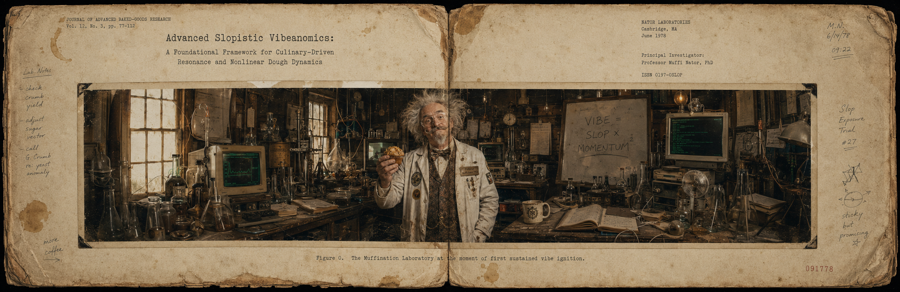
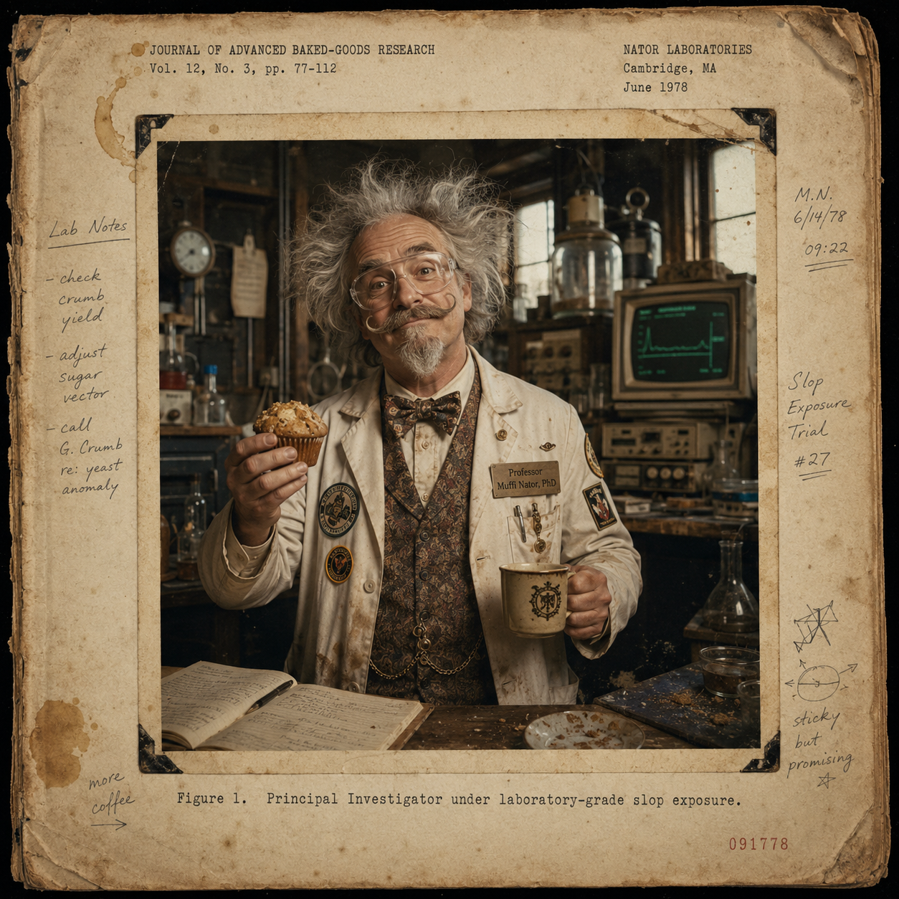
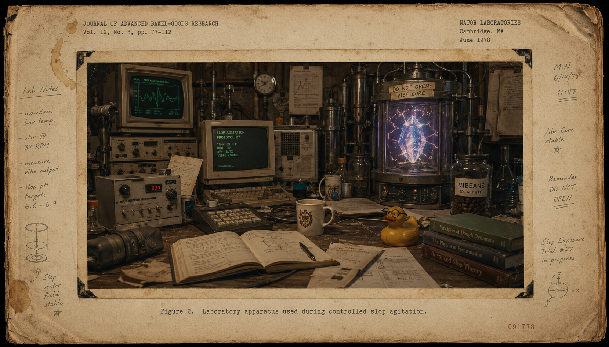
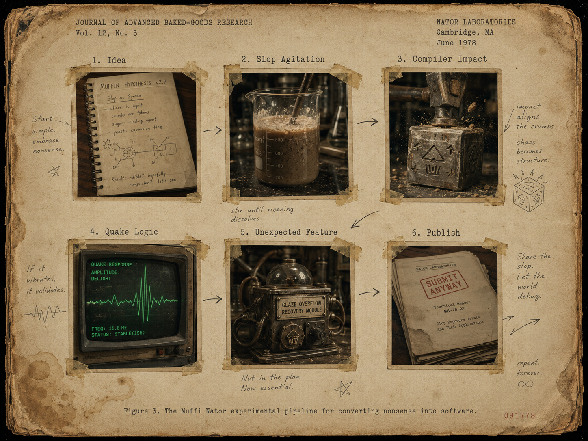
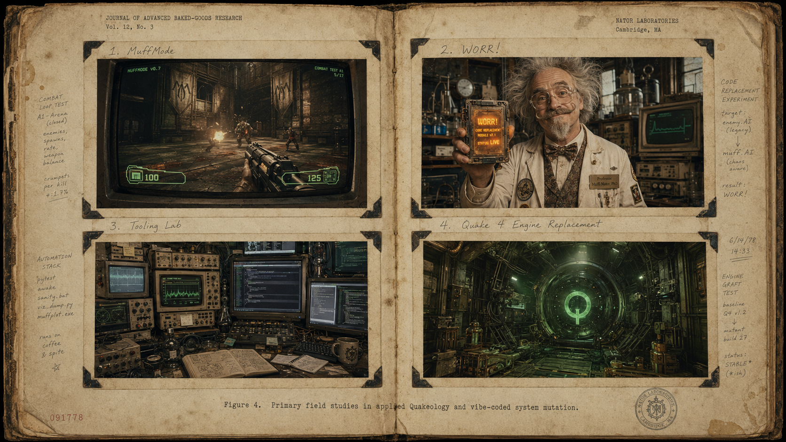
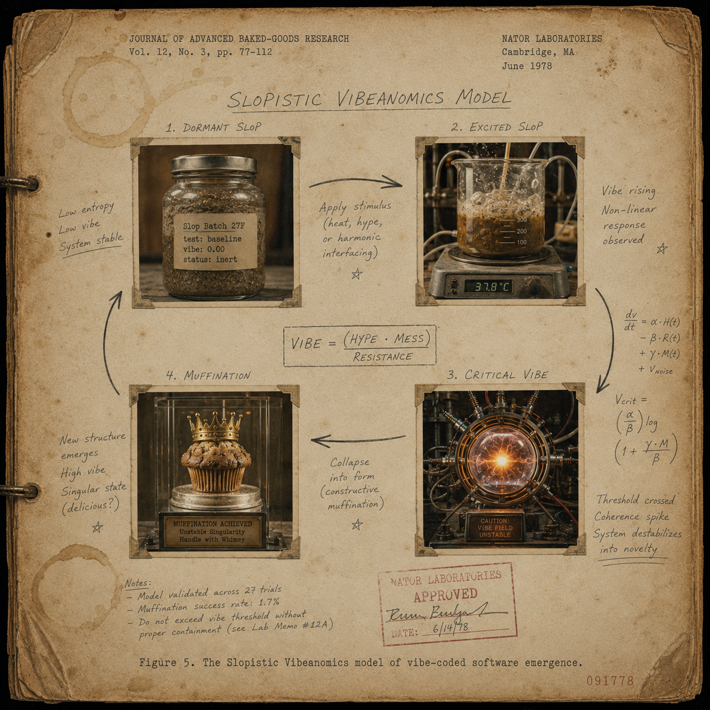
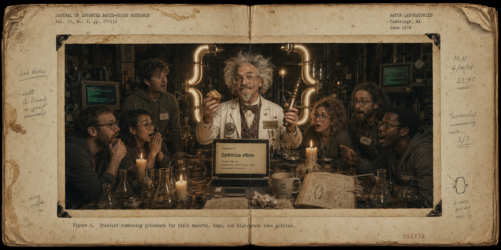

<div align="center">

# Prof. Muffi Nator, PhD  
## Department of Advanced Slopistic Vibeanomics

### A peer-unreviewed scientific profile on the discovery, weaponisation, and irresponsible mastery of vibe coding


<br/><br/>

**Institute:** The Royal Intergalactic Muffination Laboratory  
**Field:** Slop Dynamics, Compiler Archaeology, Applied Quakeology  
**Principal Investigator:** Professor Muffi Nator, PhD  
**Research Status:** Unstable, luminous, compiling

</div>

---

<!--
IMAGE ASSET: fig00-muffi-nator-lab-banner.png
SIZE: 1600 × 520 px
ASPECT RATIO: 40:13
PURPOSE: Primary README masthead.
PROMPT BRIEF: A cinematic laboratory banner showing Professor Muffi Nator in a glowing lab coat, surrounded by CRT monitors, Quake maps, neon pink and green vapor, muffin crumbs, code fragments, and a whiteboard equation reading "VIBE = SLOP × MOMENTUM²". The tone should be ludicrous, colourful, high-energy, and scientific-shitpost elegant.
-->
<p align="center">
  
</p>

<p align="center">
  <em>Figure 0. The Muffination Laboratory at the moment of first sustained vibe ignition.</em>
</p>

---

## Abstract

This document presents the preliminary, excessive, and academically dubious findings of **Professor Muffi Nator, PhD in Advanced Slopistic Vibeanomics**, whose work concerns the conversion of raw chaos into operational software through the controlled application of vibe coding.

The central thesis is simple:

> **When sufficient nonsense is exposed to enough compiler pressure, useful engineering may accidentally emerge.**

Through repeated experiments involving Quake engines, speculative tooling, competitive mod design, code replacement rituals, and caffeinated intuition, Professor Muffi Nator has demonstrated that vibe coding is not merely a development methodology. It is a volatile scientific discipline, a lifestyle hazard, and possibly a minor public health event.

---

## Table of Contents

1. [Principal Investigator](#1-principal-investigator)  
2. [Research Hypothesis](#2-research-hypothesis)  
3. [Laboratory Apparatus](#3-laboratory-apparatus)  
4. [Experimental Method](#4-experimental-method)  
5. [Primary Field Studies](#5-primary-field-studies)  
6. [Observed Results](#6-observed-results)  
7. [The Slopistic Vibeanomics Model](#7-the-slopistic-vibeanomics-model)  
8. [Reproducibility Protocol](#8-reproducibility-protocol)  
9. [Summoning Procedure](#9-summoning-procedure)  
10. [Image Asset Production Script](#10-image-asset-production-script)

---

## 1. Principal Investigator

| Attribute | Observation |
|---|---|
| Name | **Professor Muffi Nator, PhD** |
| Discipline | Advanced Slopistic Vibeanomics |
| Known Specialisms | Vibe coding, Quake engineering, idTech spelunking, toolchain intimidation |
| Lab Conditions | Caffeinated, overclocked, spiritually adjacent to a rocket jump |
| Primary Thesis | Good software can emerge from chaos when the vibes are sufficiently weaponised |
| Institutional Review Board | Fled the premises |

Professor Muffi Nator began as a humble investigator of code, logic, build systems, and the faint screaming sound emitted by ancient engines under modern expectations.

The breakthrough came during the now-famous **Muffination Event**, in which a perfectly ordinary development session exceeded its legal vibe limit and collapsed into a self-sustaining slop singularity. From that moment, the Professor no longer merely wrote code.

He **cultivated phenomena**.

<!--
IMAGE ASSET: fig01-professor-muffi-nator-portrait.png
SIZE: 900 × 900 px
ASPECT RATIO: 1:1
PURPOSE: Character portrait for the principal investigator section.
PROMPT BRIEF: A square portrait of Professor Muffi Nator wearing oversized safety goggles and a lab coat covered in Quake/idTech patches. He holds a muffin in one hand and a glowing C++ file in the other. The background contains neon equations, sparks, floating compiler warnings, and an ominous terminal window. Colourful, ludicrous, pseudo-academic, high contrast.
-->
<p align="center">
  
</p>

<p align="center">
  <em>Figure 1. Principal Investigator under laboratory-grade slop exposure.</em>
</p>

---

## 2. Research Hypothesis

The working hypothesis of Advanced Slopistic Vibeanomics is expressed as follows:

```txt
Useful Output = (Intent × Momentum × Coffee) / Fear
```

Where:

- **Intent** is the stubborn belief that the thing can work.
- **Momentum** is the refusal to stop when the codebase starts making threats.
- **Coffee** is a measurable fluid of questionable ethics.
- **Fear** is reduced through repetition, poor sleep, and exposure to legacy engine internals.

The Professor’s research suggests that vibe coding is not the absence of discipline. It is discipline wearing a clown wig and carrying a profiler.

---

## 3. Laboratory Apparatus

<div align="center">

### Languages and Runtime Specimens


<br/><br/>

### Engine and Graphics Reagents


<br/><br/>

### Toolchain Containment Equipment


</div>

<!--
IMAGE ASSET: fig02-slopistic-laboratory.png
SIZE: 1400 × 800 px
ASPECT RATIO: 7:4
PURPOSE: Visual support for the lab/tooling/environment section.
PROMPT BRIEF: A chaotic research bench filled with mechanical keyboards, half-built Quake maps, printed compiler warnings, mugs of coffee, a rubber duck wearing a graduation cap, tangled cables, old CRT monitors, and a glowing containment chamber labelled "DO NOT OPEN: VIBE CORE". Colourful scientific satire with crisp details.
-->
<p align="center">
  
</p>

<p align="center">
  <em>Figure 2. Laboratory apparatus used during controlled slop agitation.</em>
</p>

---

## 4. Experimental Method

The Muffi Nator protocol is a five-stage procedure for transforming absurd ideas into working systems.

### 4.1 Observe the Vibe

The Professor begins by staring directly into the problem until the problem becomes uncomfortable.

```txt
Input: vague idea
Output: suspicious confidence
Risk level: high
```

### 4.2 Agitate the Slop

The idea is stirred with code, prompts, experiments, prototypes, and enough optimism to concern nearby professionals.

```txt
Input: suspicious confidence
Output: first runnable artefact
Risk level: spicy
```

### 4.3 Compile Under Pressure

The prototype is exposed to toolchains, warnings, undefined behaviour, and emotional damage.

```txt
Input: first runnable artefact
Output: something that technically executes
Risk level: legally interesting
```

### 4.4 Apply Quake Logic

When the experiment becomes unstable, the Professor introduces ancient arena-shooter wisdom:

- movement must feel sharp,
- systems must respond immediately,
- latency is a goblin,
- friction is the enemy,
- rockets solve more problems than expected.

### 4.5 Publish Before the Slop Escapes

Once the system works well enough to impress the lab animals, it is documented, shipped, revised, broken, fixed, and declared a major contribution to science.

<!--
IMAGE ASSET: fig03-vibe-coding-workflow.png
SIZE: 1200 × 900 px
ASPECT RATIO: 4:3
PURPOSE: Workflow diagram for the experimental method.
PROMPT BRIEF: A fake scientific flowchart showing the pipeline "Idea → Slop Agitation → Compiler Impact → Quake Logic → Unexpected Feature → Publish". Include warning symbols, neon arrows, lab annotations, a tiny escaped muffin wearing safety glasses, and faux peer-review stamps. Clean enough to read, absurd enough to feel unhinged.
-->
<p align="center">
  
</p>

<p align="center">
  <em>Figure 3. The Muffi Nator experimental pipeline for converting nonsense into software.</em>
</p>

---

## 5. Primary Field Studies

### 5.1 MuffMode — Competitive Quake II Rerelease Phenomenology

**MuffMode** is the Professor’s competitive Quake II Rerelease mod and a key field site for applied vibe dynamics.

Its research objectives include:

- measuring the relationship between player panic and projectile velocity,
- increasing the density of “how did that hit me?” events,
- creating competitive systems with clarity, punch, and absurd charm,
- proving that chaos can still be tuned.

> **Scientific classification:** Controlled arena turbulence  
> **Primary reagent:** Quake II Rerelease  
> **Observed behaviour:** High-energy combat, competitive nonsense, measurable grin output

### 5.2 WORR! — Full Code Replacement Mayhem

**WORR!** is a full code replacement project for Quake II Rerelease, designed for extensive new features, deeper systems, and a broader experimental surface.

In the literature of Slopistic Vibeanomics, WORR! is considered a **Class IV Replacement Goblin**: ambitious, loud, unstable during feeding, and extremely productive when handled with gloves.

> **Scientific classification:** Total-code replacement organism  
> **Primary reagent:** Quake II Rerelease  
> **Observed behaviour:** Feature expansion, system mutation, architectural audacity

### 5.3 Tooling Lab — Automation as Applied Mischief

The Tooling Lab exists because the Professor cannot observe a repetitive workflow without attempting to bully it into automation.

Typical experiments include:

- build workflow refinement,
- editor and pipeline utilities,
- development helpers,
- asset-processing rituals,
- anything that reduces friction or increases ridiculous speed.

> **Scientific classification:** Workflow acceleration chamber  
> **Primary reagent:** developer impatience  
> **Observed behaviour:** Time savings, mysterious scripts, smugness

### 5.4 Quake 4 Engine Replacement — idTech 4 Necromancy

The Quake 4 engine replacement project represents the Professor’s advanced work in modernising, stabilising, and extending the ancient machinery without asking 2005 for permission.

This research remains unsuitable for timid keyboards.

> **Scientific classification:** Engine-scale resurrection event  
> **Primary reagent:** idTech 4  
> **Observed behaviour:** Modernisation, extension, forbidden confidence

<!--
IMAGE ASSET: fig04-quake-field-studies.png
SIZE: 1600 × 900 px
ASPECT RATIO: 16:9
PURPOSE: Visual summary of the four major project/research areas.
PROMPT BRIEF: A four-panel collage: MuffMode arena combat, WORR! code replacement chaos, a tooling dashboard, and a Quake 4/idTech 4 engine chamber. Strong colour separation across panels: magenta, cyan, orange, and electric green. Scientific labels and absurd lab annotations should identify each panel.
-->
<p align="center">
  
</p>

<p align="center">
  <em>Figure 4. Primary field studies in applied Quakeology and vibe-coded system mutation.</em>
</p>

---

## 6. Observed Results

| Experiment | Initial Condition | Intervention | Result |
|---|---|---|---|
| MuffMode | Competitive Quake II needed more Muffination | Applied arena-grade vibe coding | Increased chaos with competitive intent |
| WORR! | Existing code boundaries appeared too polite | Initiated replacement protocol | Expanded feature potential and system control |
| Tooling Lab | Repetition detected | Automated with prejudice | Workflow friction reduced |
| Quake 4 Engine Replacement | Legacy engine required modern handling | Applied idTech excavation and reconstruction | Large-scale technical resurrection event |

The Professor reports the following recurring effects:

```txt
[+] faster prototyping
[+] stranger ideas surviving contact with reality
[+] more experiments reaching playable form
[+] toolchains showing signs of submission
[-] occasional compiler rebellion
[-] intermittent documentation goblins
[-] muffins missing from containment
```

---

## 7. The Slopistic Vibeanomics Model

The core model proposes that software development can be divided into four energetic states.

| State | Description | Risk | Usefulness |
|---|---|---:|---:|
| Dormant Slop | Idea exists but has not been touched | Low | Low |
| Excited Slop | Prototype energy begins forming | Medium | Medium |
| Critical Vibe | Momentum exceeds uncertainty | High | High |
| Muffination | The thing works and nobody fully understands why | Extreme | Maximum |

The Professor’s contribution is the discovery that **Critical Vibe** can be sustained long enough to produce useful software, provided the researcher maintains adequate hydration, version control, and spiritual distance from undefined behaviour.

<!--
IMAGE ASSET: fig05-slopistic-vibeanomics-model.png
SIZE: 1200 × 1200 px
ASPECT RATIO: 1:1
PURPOSE: Conceptual model diagram for the Slopistic Vibeanomics theory.
PROMPT BRIEF: A fake academic diagram showing four energy states: Dormant Slop, Excited Slop, Critical Vibe, and Muffination. Include arrows, pseudo-equations, glowing particles, lab stamps, a muffin-shaped singularity, and a tiny Quake rocket launcher as the final catalyst.
-->
<p align="center">
  
</p>

<p align="center">
  <em>Figure 5. The Slopistic Vibeanomics model of vibe-coded software emergence.</em>
</p>

---

## 8. Reproducibility Protocol

To reproduce Professor Muffi Nator’s results, the following conditions are recommended:

1. Select a project with unreasonable emotional gravity.
2. Define the smallest useful thing that could exist.
3. Build it before doubt files a planning application.
4. Test until the machine stops lying.
5. Refactor only after the monster has a pulse.
6. Repeat until the vibe becomes architecture.

### Minimum viable laboratory configuration

```txt
OS: whatever currently behaves
Editor: preferably obedient
Compiler: hostile but useful
Coffee: yes
Source control: mandatory
Soundtrack: suspiciously intense
Muffins: optional, but statistically significant
```

---

## 9. Summoning Procedure

Prospective collaborators, bug reporters, idea goblins, and fellow researchers may initiate contact by opening an issue containing one or more of the following:

- a cursed bug,
- a wild feature proposal,
- a screenshot of behaviour that should not be possible,
- a technical question with dramatic implications,
- the phrase: **“Professor, the slop is vibrating.”**

Upon receipt, Professor Muffi Nator may appear with:

```txt
1. a theory,
2. a patch,
3. three alternate patches,
4. a new tool nobody asked for,
5. and a graph proving this was science.
```

<!--
IMAGE ASSET: fig06-summoning-ritual.png
SIZE: 1400 × 700 px
ASPECT RATIO: 2:1
PURPOSE: Closing visual for collaboration/contact section.
PROMPT BRIEF: A dramatic neon ritual scene where developers stand around a glowing GitHub issue, chanting beside a terminal. Professor Muffi Nator descends from a portal made of curly braces, carrying a muffin and a debugger. Tone should be ridiculous, colourful, mystical, and still vaguely scientific.
-->
<p align="center">
  
</p>

<p align="center">
  <em>Figure 6. Standard summoning procedure for field reports, bugs, and high-grade idea goblins.</em>
</p>

---

## Current Research Metrics

<div align="center">


</div>

---

## Conclusion

The evidence indicates that Professor Muffi Nator, PhD, has achieved a rare and unstable command of Advanced Slopistic Vibeanomics.

Through MuffMode, WORR!, tooling experiments, Quake engine work, and an alarming tolerance for controlled technical absurdity, the Professor has demonstrated that vibe coding is not random flailing. It is **applied intuition under experimental pressure**, expressed through code, chaos, and the occasional muffin-related anomaly.

Further study is recommended.

Further containment is unlikely.

---

<div align="center">

### Final Disclosure

This README is a scientific document in the same way a rocket jump is public transport.

**All vibes. No warranty. May contain trace quantities of slop, muffins, idTech, and reckless forward momentum.**

</div>
